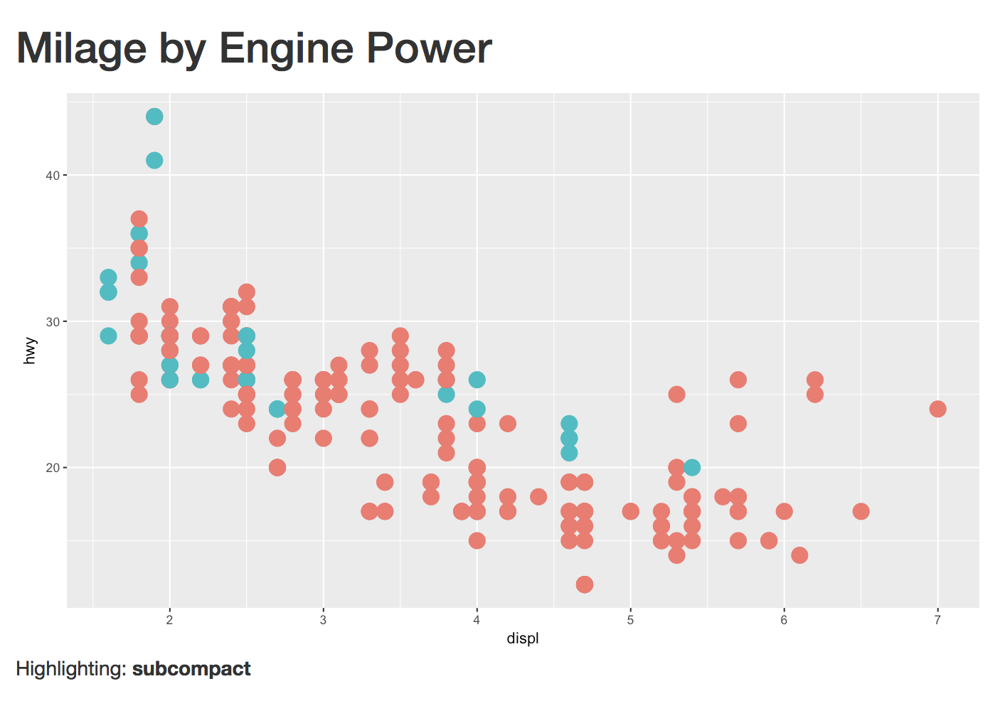

# Exercise 5
In this exercise, you'll practice building an interactive plot with Shiny's built-in features. This app will let you highlight car classes from the `mpg` data set:

To complete the exercise, open the `exercise-5/app.R` file in RStudio, and follow the instructions there.
